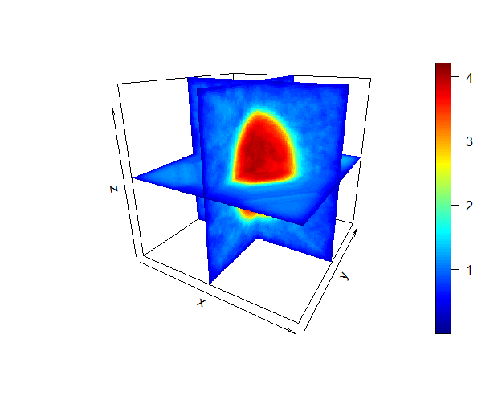
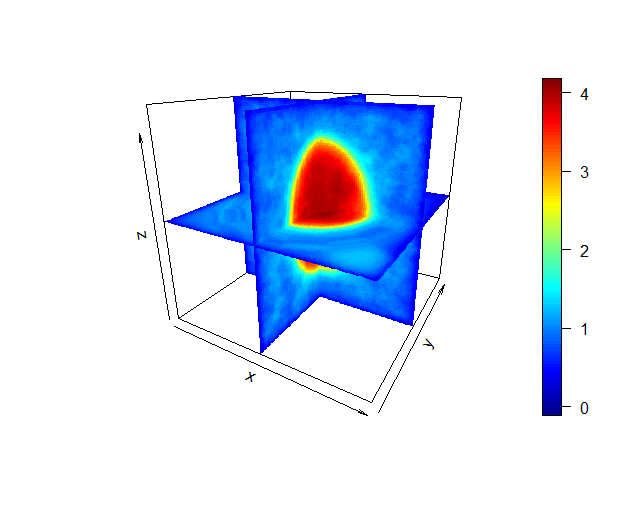
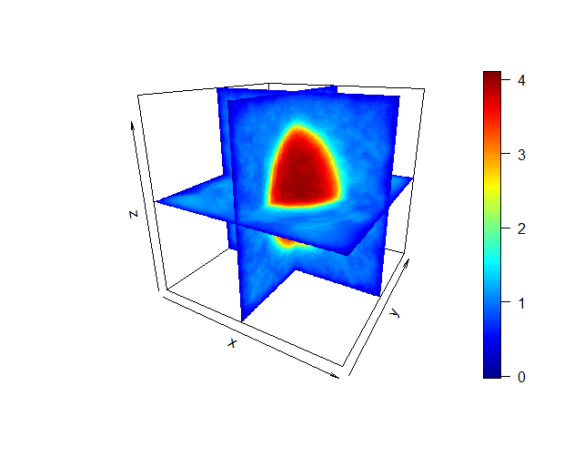

### Efficient 3-D Reconstruction in Ultrasound Elastography via a Sparse Iteration Based on Markov Random Fields  基于 Markov 随机场的稀疏叠代法的弹性成像三维重建

[TOC]

####  Abstract 摘要

> Percutaneous needle-based liver ablation procedures are becoming increasingly common for the treatment of small isolated tumors in hepatocellular carcinoma patients who are not candidates for surgery. Rapid 3-D visualization of liver ablations has potential clinical value, because it can enable interventional radiologists to plan and execute needlebased ablation procedures with real time feedback. Ensuring the right volume of tissue is ablated is desirable to avoid recurrence of tumors from residual untreated cancerous cells. **Shear wave velocity (SWV) measurements can be used as a surrogate for tissue stiffness to distinguish stiffer ablated regions from softer untreated tissue.** 
>
> This paper **extends the previously reported sheaf reconstruction method** to generate complete 3-D visualizations of SWVs without resorting to an approximate intermediate step of reconstructing transverse C planes. The noisy data are modeled using a Markov random field, and a computationally tractable reconstruction algorithm that can handle grids with millions of points is developed. Results from simulated ellipsoidal inclusion data show that this algorithm outperforms standard nearest neighbor interpolation by an order of magnitude in mean squared reconstruction error. Results from the phantom experiments show that it also provides a higher contrast-to-noise ratio by almost 2 dB and better signal-to-noise ratio in the stiff inclusion by over 2 dB compared with nearest neighbor interpolation and has lower computational complexity than linear and spline interpolation.

以经皮肤的为基础的肝脏穿刺术在治疗不适合手术的小型分离出的肝细胞癌病人中正变得越来越普遍。肝脏消融的快速三维可视化具有潜在的临床价值，因为它可以使介入放射科医师计划和执行以针刺为基础的切除术治疗程序，并得到读出时间反馈。确保切除正确体积的组织是可取的，以避免肿瘤复发从残留未经处理的癌性的细胞。<u>剪切波速(SWV)测量</u>可以作为组织刚度的替代品，用于区分硬化烧蚀区域和未处理的较软组织。

本文<u>扩展了以前报道的**层重建**</u>方法，以生成SWV的完整3-D可视化效果，而无需诉诸于重构横向C平面的近似中间步骤。使用马尔可夫随机场对噪声数据进行建模，并开发了一种可以处理具有数百万个点的网格的易于计算的重建算法。模拟椭球包含数据的结果表明，该算法在均方根重构误差方面比标准最近邻插值好一个数量级。模体实验的结果表明，与最近邻插值法相比，它在刚性夹杂物中还提供了更高的对比度-噪声比近2dB，以及更好的信噪比2 dB以上，并且具有比线性插值法更低的计算复杂度和样条插值。

[^层重建]: 

[^剪切波]: [剪切波](https://baike.baidu.com/item/%E5%89%AA%E5%88%87%E6%B3%A2/3325136)是传播方向与介质质点的振动方向垂直的波。又称横波，S波。简单来说：只要让组织产生一定程度的震动或者形变，就可以在其周围出现剪切波传播。
[^SWV ]: 剪切波波速，测值与纤维化分级显著祥光，可以反应组织的硬度（可以无创评价肝纤维化程度）
[^最近邻插值法]: 是指将目标图像中的点，对应到源图像中后，找到最相邻的整数点，作为插值后的输出。这是一种简单的插值算法：不需要计算，在待求象素的四邻象素中，将距离待求象素最近的邻象素灰度赋给待求象素设i+u, j+v(i, j为正整数， u, v为大于零小于1的小数，下同)为待求象素坐标，则待求象素灰度的值 f(i+u, j+v) 如下图所示：如果(i+u, j+v)落在A区，即u<0.5, v<0.5，则将左上角象素的灰度值赋给待求象素，同理，落在B区则赋予右上角的象素灰度值，落在C区则赋予左下角象素的灰度值，落在D区则赋予右下角象素的灰度值。 最邻近元法计算量较小，但可能会造成插值生成的图像灰度上的不连续，在灰度变化的地方可能出现明显的锯齿状。scr: 原图；dstx/y ：位置 ；dst : 目标图

$$
f(dst_x,dst_y)=h(\frac{dst_x \times src_{Width}}{dst_{Width}},\frac{dst_y \times src_{Height}}{dst_{Height}})
$$

[^信噪比SNR]: 信噪比（signal to noise ratio，SNR）是MRI最基本的质量参数，是指图像的信号强度与背景噪声强度之比。所谓信号强度是指某一感兴趣区内各像素信号强度的平均值；噪声是指同一感兴趣区等量像素信号强度的标准差。重叠在图像上的噪声使像素的信号强度值以平均值为中心而振荡，噪声越大，振荡越明显，SNR越低，图像越模糊。SNR越高，图像质量越高。
[^均方误差（MSE）mean square error]: 指参数估计值与参数真值之差平方的期望值，MSE可以评价数据的变化程度，MSE的值越小，说明预测模型描述实验数据具有更好的精确度。
[^样条插值]: 

> 3-D reconstruction, ablation, electrode vibration, Ising model, Markov random field (MRF), sheaf, shear wave elastography, ultrasound  3-D重建，消融，电极振动，伊辛模型，马尔可夫随机场（MRF），束，剪切波弹性成像，超声。

- [x] ##### 解决的问题？

  不需要诉诸重建横向C平面的近似中间步骤，生成完整的 SWVs 三维可视化图

- [x] ##### 用到的理论和模型？

  1、extends the previously reported sheaf reconstruction method  扩展了以前报道的层重建方法，不需要重构横向C平面的近似中间步骤。

  2、MRF：markov随机场对噪声数据进行建模（其中夹杂了Ising model）。

- [x] ##### 答案answer？

  1、可以处理具有数百万个点的网格的易于计算的重建算法。
  
  2、均方根重构误差方面(MSE)比标准最近邻插值(NNB)好一个数量级。
  
  3、具有比线性插值法（LIN）更低的计算复杂度和样条插值
  
  
  
  **[剪切波弹性成像](https://www.jianshu.com/p/2381472b1158)** **（SWE）**：（横波）只要让组织产生一定程度的震动或者形变，就可以在其周围出现剪切波传播。 
  
  SWE是目前最先进的超声弹性成像技术，采用超声探头发射高速激励脉冲，连续聚焦于组织不同层面，发生局部声辐射力，使组织发生振动产生剪切波，形成“马赫锥”效应；利用超高速成像处理技术迅速捕获剪切波的演变并获得弹性图像，使用彩色编码技术将弹性分布图叠加于二维声像图之上，实时显示组织弹性图，采用Q-box软件测量组织杨氏模量值，进而提供组织的软硬度信息。

------

#### 1、 Introduction 介绍

> ultrasound elastography is a safe and rapid method for imaging elastic properties of tissues. Following the pioneering work of Ophir et al. [1] that laid the groundwork for signal processing methods for estimating displacements and strain from raw ultrasound echo data (quasi-static ultrasound elastography), research in ultrasoundbased tissue elasticity imaging has now enabled the measurement of many different properties, such as Young’s modulus [2], shear modulus [3], [4], shear wave velocity (SWV) [5]–[9], and viscoelastic properties [10]. This paper deals with the problem of reconstruction of the 3-D visualization of SWVs from data acquired over 2-D image planes.
>
> 超声弹性成像是一种对组织的弹性特性成像的安全，快速的方法。 继Ophir等人的开拓性工作之后。 [1] <!--弹性成像：一种定量成像生物组织弹性的方法--> 为从原始超声回波数据估计位移和应变的信号处理方法（准静态超声弹性成像）奠定了基础，基于超声的组织弹性成像研究现已能够测量许多不同的特性，例如杨氏模量[ 2]，剪切模量[3]，[4]，剪切波速度（SWV）[5]-[9]和粘弹性[10]。 **本文讨论了从二维图像平面上获取的数据重构SWV的3-D可视化问题。**
>
> Electrode vibration-based shear wave elastography (EVE) [7], [8] is a type of transient elastography technique, which is particularly suited for monitoring percutaneous needle-based ablation procedures. **Radio frequency (RF)** and microwave ablation have become common clinical procedures in interventional radiology for treating hepatocellular carcinoma [11]. Ablation is typically used for patients who are not candidates for surgical resection and have a fairly localized tumor of diameter less than 5 cm [12]. 
>
> 基于电极振动的剪切波弹性成像（EVE）[7]，[8]是一种瞬态弹性成像技术，特别适合于监测基于针头的经皮消融手术。 射频（RF）和微波消融已成为介入放射学中治疗肝细胞癌的常见临床程序[11]。 消融通常用于不适合手术切除且肿瘤局部直径小于5 cm的患者[12]。

[^1]:  J. Ophir, I. Céspedes, H. Ponnekanti, Y. Yazdi, and X. Li, “Elastography: A quantitative method for imaging the elasticity of biological tissues,” Ultrason. Imag., vol. 13, no. 2, pp. 111–134, Apr. 1991. 弹性成像：一种定量成像生物组织弹性的方法 。 [超声弹性成像](https://baike.baidu.com/item/超声弹性成像/9460034?fr=aladdin)：超声弹性成像是利用生物组织的弹性信息帮助疾病的诊断。现在处于观察研究阶段。根据不同组织间弹性系数不同，在受到外力压迫后组织发生变形的程度不同，将受压前后回声信号移动幅度的变化转化为实时彩色图像，**弹性系数小、受压后位移变化大的组织显示为红色，弹性系数大、受压后位移变化小的组织显示为蓝色，弹性系数中等的组织显示为绿色，借图像色彩反映组织的硬度。**
[^杨氏模量]: 又称 [拉伸模量](https://baike.baidu.com/item/%E6%9D%A8%E6%B0%8F%E6%A8%A1%E9%87%8F/4826110?fr=aladdin)，是描述固体材料抵抗形变能力的物理量。“越大越硬”
[^剪切模量]: 又称[切变模量](https://baike.baidu.com/item/剪切模量)或刚性模量。是剪切应力与应变的比值，它表征材料抵抗切应变的能力。模量大，则表示材料的刚性强。

> Ablation uses electromagnetic heating to above 60 ◦C, which causes protein denaturation and cell necrosis [13]. As part of the treatment planning stage, the patients typically undergo an MRI or CT scan to locate the tumor. B-mode ultrasound is used during the minimally invasive procedure to guide the ablation needle into the tumor, and the procedure is followed by a postablation MR or CT scan to ensure that the right volume of the cancerous tissue is treated [14]. Ablation planning and monitoring is important, because residual untreated cancerous cells may cause the tumor to recur and necessitates additional treatment if seen on the postablation scans. 
>
> 消融使用电磁加热到60℃以上，导致蛋白质变性和细胞坏死[13]。作为治疗计划阶段的一部分，患者通常要进行核磁共振或CT扫描以定位肿瘤。在微创手术过程中使用B超引导消融针进入肿瘤，然后在手术后进行MRI(核磁共振)或CT扫描，以确保癌组织的正确体积得到治疗[14]。消融计划和监测是很重要的，因为残留的未经治疗的癌细胞可能会导致肿瘤复发，如果在切除后的扫描上看到，就需要额外的治疗。
>
> B-mode ultrasound does not provide a reliable way to locate the ablation boundary**, because tissue echogenicity may not be correlated with stiffness [15].** On the other hand, ultrasound shear wave elastography has the potential to provide immediate feedback to clinicians about the extent of an ablation by using the speed of a shear wave as a surrogate for tissue stiffness [16]–[18]. Although it is safer and faster than other imaging modalities that use ionizing radiation, it has the disadvantage of **not being able to provide the same level of high resolution 3-D reconstructions**. Ultrasound elastography is typically used to obtain 2-D image reconstructions of tissue stiffness, because 1-D array probes are still more commonly used in clinical procedures than 2-D matrix arrays. Although it may be possible to perform 3-D transient elastography using a 2-D matrix array transducer [19], [20], the frame rates are too low to track the propagationof a shear wave in a single volume acquisition. Therefore, a method for rapidly reconstructing a 3-D visualization from multiple 2-D slice acquisitions has a clinical value.
>
> **B超不能提供可靠的方法来定位消融边界，因为组织回声可能与硬度无关**[15]。另一方面，**超声剪切波弹性成像有可能通过使用剪切波的速度作为组织刚度的替代物，**向临床医生提供关于消融程度的即时反馈[16]–[18]。虽然它比其他使用电离辐射的成像方式更安全、更快，但**它的缺点是不能提供同样水平的高分辨率三维重建。**超声弹性成像通常用于获得组织刚度的二维图像重建，因为在临床操作中，一维阵列探头仍然比二维矩阵阵列更常用。虽然可以使用二维矩阵阵列传感器进行三维瞬态弹性成像[19]，[20]，但帧速率太低，无法在单个体积采集中跟踪横波的传播。因此，一种从多个二维切片中快速重建三维可视化的方法具有临床价值。

**超声弹性成像：**超声弹性成像这一技术，其基本原理是根据组织受力后形变程度的不同来显示组织的不同硬度，从而反映疾病发生、发展情况，为临床诊疗提供帮助。剪切波弹性成像技术，其原理是声源振动产生声波，当声波在传播途径上被反射或吸收时，会产生声辐射力，该力会使组织粒子产生横向振动，从而产生剪切波，通过跟踪剪切波的传播速度得到组织弹性的绝对值——杨氏模量(E=3ρct2)，从而定量分析、比较各组织间的弹性差异，辅助临床诊断。 2D- 实时剪切波弹性成像(shear wave elastography， SWE)。SWE 基于超声无创、便捷的优势，可快速、客观、定量地反映生物力学信息，即组织硬度(杨氏模量)，其成为目前最为成熟的超声弹性成像技术，并已广泛应用于肝脏、甲状腺、乳腺等器官的检查。

> The sheaf of ultrasound planes reconstruction method was presented in [21] for obtaining the C plane (i.e., transverse plane) reconstructions of SWVs. Instead of using an approximate approach of reconstructing individual transverse planes, **this paper proposes a more general method for reconstruction on a full 3-D grid while also handling ill-posed situations, where the number of grid points may exceed the number of data points.** A computationally tractable algorithm that can handle large grid sizes with millions of grid points in 3-D is also presented. A standard method for dealing with fast interpolation of scattered data on a grid is through nearest neighbor interpolation [22], and has been previously used for the 3-D reconstruction of B-mode ultrasound images from 2-D slices [23]. The algorithm presented here provides an order of magnitude better mean squared reconstruction error and higher signal-to-noise ratio (SNR) than nearest neighbor interpolation, as demonstrated through simulations and data acquired from a tissue mimicking (TM) phantom experiment.
>
> 文献[21]提出了一种超声平面重建方法，用于获得SWVs的C平面（即横向平面）重建。本文提出了一种在**全三维网格上进行重建的通用方法，而不是采用近似的方法来重建单个横截面，同时也可以处理不适定情况，即网格点的数目可能超过数据点的数目**。文中还提出了一种计算简单的算法，该算法可以处理三维网格中数百万个网格点。**处理网格上散乱数据的快速插值的标准方法是通过最近邻插值[22]**，并且以前已用于从二维切片重建B型超声图像[23]。从仿真和组织模拟（TM）模型实验获得的数据表明，与最近邻插值相比，本文提出的算法提供了一个数量级的更好的（MSE）均方重建误差和更高的信噪比（SNR）。

[^C平面]: C平面，即横向平面

- [x] **本文讨论内容？**

  本文讨论了从二维图像平面上获取的数据重构SWV的3-D可视化问题（从多个二维切片中快速重建三维可视化）。

- [x] **作者为什么研究这个课题？**

  1、B超没有可靠的方法来定位消融边界，因为组织回声可能与硬度无关

  2、超声剪切波弹性成像不能提供同样水平的高分辨率三维重建图像。

  3、在临床操作中，超声弹性成像通常用于获得组织刚度的二维图像重建，虽然可以使用二维矩阵阵列传感器进行三维瞬态弹性成像，但帧速率太低，无法在单个体积采集中跟踪横波的传播。

- [ ] **目前这个课题的研究进行到了哪一阶段？**

- [x] **作者使用的理论是基于哪些假设/理论/方法？**

  1、层重建方法

  2、MRF（马尔科夫随机场）

  3、最近邻插值（NNB）

  4、tissue mimicking (TM) phantom experiment.（仿真和组织模拟模型实验）

#### 2、Theory 理论

##### 1、MRF 马尔可夫随机场

> A Markov random field (MRF) generalizes the 1-D Markov property to higher dimensions. This is useful, for instance, when the random process is a function of spatial coordinates instead of time. Let {X1, X2,...,Xt,...} be a sequence of discrete valued random variables forming a Markov chain. Then, the joint conditional density function of a variable conditioned on the past satisfies the following property: 
>
> 马尔可夫网络将一维马尔科夫性质推广到更高的维度。例如，当随机过程是空间坐标的函数而不是时间的函数时，这是很有用的。设{ X1，X2，... ，Xt，... }是构成马氏链的离散值随机变量序列。然后，以过去为条件的变量的联合条件密度函数满足以下性质:
>
> 
>
> The same idea can be extended to a “random field” indexed by spatial coordinates as follows. Consider an infinite lattice of nodes indexed by triplets −∞ < i, j, k < ∞. The MRF property can be written as 
>
> 同样的思想可以扩展到以空间坐标为索引的“随机场” ，如下所示。考虑用三元组索引的无限节点格-∞ < i，j，k < ∞。MRF 属性可以写为
>
> 
>
> that is, the value at any given node when conditioned on its immediate neighbors is independent of all other node values. These conditions can be analogously defined using continuous density functions (instead of discrete probability mass functions) for random variables defined on a continuous state space. Also, in practice, it is assumed that the grid size is finite 1≤i ≤ Ny,1≤ j ≤ Nx, and 1≤k ≤ Nz where Nx, Ny, and  Nz, respectively, denote the number of grid points along the x-, y-, and z-dimensions of the 3-D volume. 
>
> 也就是说，任何给定节点的值，当条件是它的直接邻居是独立于所有其他节点的值。这些条件可以用连续状态空间中定义的随机变量的连续密度函数(而不是离散概率质量函数)来类比定义。在实际应用中，假设网格大小为有限的1≤ i ≤ Ny，1≤ j ≤ Nx，1≤ k ≤ Nz，其中 Nx、Ny 和 Nz 分别表示三维体的 x 维、 y 维和 z 维上网格点的个数。

- [ ] **[MRF 马尔科夫随机场](https://blog.csdn.net/vbskj/article/details/53338032)**

  - **概率图模型**

    简单来说：概率图模型 = 图论 + 概率论。

    概率图的建模分为两个步骤。第一，用概率图的结构来描述概率关系。第二，加入概率值进行完整描述。

  - **马尔科夫随机场**

    <!--所谓的马尔科夫特性，就是当前变量的值只和距离最近的变量有关系；在马尔科夫场中还有一个性质，就是如果一个点的直接相邻节点都确定了的话，那么这个点的概率就和所有非相邻节点都独立了，这也就是所谓的马尔科夫性。-->
    
    马尔科夫随机场其实就是一种无向的概率图。
    

> For this paper, a 3-D lattice Ising model [24, Ch. 1] is used, because the final goal is to reconstruct the measured quantity on a fine grid of points in 3-D. An Ising model captures the dependence of values at each grid node as influenced by the values at its immediate neighboring nodes.
>
> 本文建立了一个三维格子Ising模型[24，Ch.1]被使用，因为最终目标是在一个精细的三维点网格上重建被测量的数量。**伊辛模型捕获每个网格节点上的值的依赖关系，这取决于其邻近节点上的值的影响。**
>
> 
>
> Fig1。利用网格节点的六个邻域来计算每个网格点的团势。离中央网格点最近的数据点也用于保持**数据保真度**<!--数据保真项保证结果符合降质过程-->。
>
> A similar idea was used by Gorce et al. [25] to model RF ultrasound data for spectral processing. Temporarily ignoring the grid points lying on the boundary, a six neighborhood of each node, as shown in Fig. 1, is used to define “clique potentials” as follows [26]: 
>
> 一个类似的想法被Gorce等人用于[25]模型射频超声数据的光谱处理。暂时忽略边界上的网格点，每个节点的六个邻域，如图1所示，用来定义“团势”如下[26] :

[^团势]: 无向图G中任何两个结点均有边连接的结点子集称为团。

> 
>
> where $d_{i,j,k}$ is the value of the data point closest to the node at lattice location (i, j,k) and$\Delta x,\Delta y ,\Delta z$ are the grid resolutionsalongthe three axes.Theintuitionbehindusingthis potential function is as follows. The first term is a data fidelity term that encourages the node values to be close to the values at nearby data points. The next three terms are the secondorder finite differences that approximate the second derivative at each node location to promote smoothness. 
>
> 其中 $d_{i,j,k}$是格点位置(i,j,k)最接近节点的数据点的值，$\Delta x,\Delta y ,\Delta z$是 三个 的网格分辨率。这个势函数的直观性如下。第一个术语是数据保真术语，它鼓励节点值接近附近数据点的值。接下来的三个项是二阶有限差分，它在每个节点位置近似二阶导数，以提高光滑度。
>
> Let u denote an Nx NyNz × 1 vector consisting of the individual ui,j,k values.1 The “energy function” is defined as the sum of the potentials over all cliques 
>
> 设 u 表示一个由 $u_{i,j,k}$值组成的 $N_xN_yN_z \times 1$矢量。能量函数”定义为所有团上的势能之和。
>
> 
>
> By the Hammersley–Clifford theorem, the joint density function for the state u of the MRF can be expressed as [27]
>
> 根据 Hammersley-Clifford 定理，MRF状态u的联合密度函数可以表示为[27]
>
> 
>
> where Z is a normalization that ensures that p integrates to unity.
>
> 其中 z 是一个标准化(归一化指数)，确保 p 集成为 unity。

- [ ] **[Ising Model（三维Ising模型）](https://blog.csdn.net/qiye005/article/details/48676781)**

  ​		Ising 模型得到提出最初是解是铁磁物质的相变，即磁铁在加热到一定临界温度以上磁性消失，而降温到临界温度以下又表现出磁性的现象。本文应用Ising模型是源于其模型是描述相互作用的粒子（或者自旋）。Ising model分为一维、二维和三维。一维是指M个自旋排成一排，每一个自旋与其左右两个近邻的自旋有相互作用。二维就是有N个同样的自旋排，每一个自旋不但与其左右两个近期临近的自旋相互作用，海域前后的自旋相互作用，同样三维就是与左右，前后，上下六个近邻的自旋相互作用。随着维度的添加，每一个自旋和周围的相互作用在增加。

- [x] **Hammersley-Clifford 定理**

  Hammersley-Clifford 定理证明了马尔可夫随机场本身就是吉布斯随机场，马尔科夫随机场的概率分布一定可以表示成一系列非负函数乘积形式。定理之所以成立，是因为马尔科夫场的平滑假设，即“一个像素要和周围像素存在关系，即他们的灰度尽可能相近，与较远的像素无关”。
  
  [^吉布斯分布]: 在无向图模型G上的一个概率分布P(X) 称之为吉布斯分布，如果它能够因子分解为定义在团(clique)上的正函数的乘积，这些团覆盖了G的所有顶点和边。即
  
  $$
  P(X) = \frac{1}{Z} \prod_{c=C_G}\phi_c(X_c)
  $$
  
  $C_G$是G上所有最大团的集合，Z是归一化常量。
  $$
  Z=\sum_x{}\prod_{c=C_G}\phi_c(X_c)
  $$
  <!--一个无向图模型的概率可以表示为定义在图上所有最大团上的势函数的乘积。-->
  
  意义：该定理是MRF进行图像去噪的基础。在去噪问题中，先验知识：去噪的图像是一个MRF，由于该定理指出起于吉布斯分布的等效性，那么我们最大化先验知识的概率，就被转化成了最小化能量，从而将一个样本图像的概率通过各个小区域的能量的乘积表示，表示方法可以参照Ising模型，思想就是一个图像区域内各个像素的亮度变化方向一致，则能量更低。（这一点可以从参考上述内容），H-C定理指明了优化的方向：**能量越小，概率越大**<!--这个思想是从统计热力学的证明过来的，该证明过程表明了通过能量的负指数表达概率的合理性。-->

##### 2、Iterative Reconstruction Algorithm 迭代重建方法

> The goal of a reconstruction algorithm is to estimate the mode of this distribution, i.e., the value of u, which  maximizes p(u), or equivalently, minimizes −log p(u) = logZ+E(u). **In most situations, it is impossible to calculate Z explicitly, because it involves integrating over all possible node values.** However, the value of Z is not required for this minimization problem, and it is sufficient to find a minimizer for E(u). · 
>
> 重建算法的目标是估计这种分布的模式，即u的值，最大化 p (u) ，或等价地，最小化对数$-\log p(u) = \log Z +E(u)$。在大多数情况下，不可能显式地计算 Z，因为它涉及对所有可能的节点值进行积分。然而，Z 的值是不需要这个最小化问题，它是足够的找到一个极小的 E (u)。
>
> 
>
> 图2：三维重建算法，以一个**等于近邻取样插值的初始猜测**开始，然后使用**稀疏矩阵更新方程对其进行改进**。这里使用的停止准则检查从一次迭代到下一次迭代的进度，如果**规范小于用户定义的容差，则停止**。还可以使用其他停止条件(例如**提前确定迭代次数)。**

> In practice, the reconstruction grid size can be quite large. For instance, even in a simple case of a hundred grid points along each of the three axes, the total number of grid points (i.e., the length of the vector u) is 10 6. A computationally tractable iterative reconstruction approach is shown in Fig. 2. The key idea is to start from an initial guess for the solution and then gradually refine the guess such that the energy function value decreases at each iteration. In order to handle large grid sizes, it is important that the updates should be easy to compute, both in terms of memory storage requirement and computational complexity. 
>
> 在实践中，重建网格的规模可以相当大。例如，即使在三个坐标轴上各有一百个网格点的简单情况下，网格点的总数(即矢量 u 的长度)也是10的6次方。一个计算易于处理的三维重建方法如图2所示。**关键思想是从解的初始猜测开始，然后逐步细化猜测，使能量函数值在每次迭代时减小。为了处理大型网格，重要的是更新应该易于计算，无论是在内存存储需求还是计算复杂性方面。**

[^greedy algorithm 贪心算法]: 贪心算法是一种对某些求最优解问题的更简单、更迅速的设计技术。贪心算法的特点是一步一步地进行，常以当前情况为基础根据某个优化测度作最优选择，而不考虑各种可能的整体情况，省去了为找最优解要穷尽所有可能而必须耗费的大量时间。贪心算法采用自顶向下，以迭代的方法做出相继的贪心选择，每做一次贪心选择，就将所求问题简化为一个规模更小的子问题，通过每一步贪心选择，可得到问题的一个最优解。

> Considerthe followinggreedyalgorithm[28,Ch. 17],which updates the value at each node myopically, by using values from the previous iteration for each neighbor. Let u(l) denote the value of the vector at iteration l, forl ≥0. The (i, j,k)th element u(l+1) i,j,k of this vector is obtained by minimizing the potential function in (1) at a fixed coordinate as follows: 
>
> 考虑下面的 greedy algorithm [28，Ch.7] ，**它通过使用前一次迭代中每个邻居的值，短距离地更新每个节点上的值。**设 u (l)表示迭代 l 上的向量的值，当 l ≥0时。这个向量的(i，j，k)元 u (l + 1) i，j，k 是通过在一个固定坐标系下使(1)中的势函数极小化得到的:
>
> 
>
> This can be solved in closed form by setting the derivative of the function on the right with respect to u to zero 
>
> 这个问题可以用封闭形式解决，方法是将函数关于 u 的右导数设为零
>
> 
>
> This is similar to the iterated conditional modes (ICMs) technique described by Besag [29]. However, note that the update is only a linear combination of the components of u(l). Therefore, unlike the original ICM algorithm where each pixel is changed individually, the complete vector can be updated in a single step using the following matrix formulation: 
>
> 这类似于 Besag [29]描述的**迭代条件模式(ICMs)**技术。但是，请注意**，这次更新只是 u (l)组件的一个线性组合。**因此，与原始的 ICM 算法不同，原始的 ICM 算法中每个像素都是单独改变的，完整的矢量可以使用以下矩阵公式在一个步骤中更新：

[^迭代模式]: Iterator 模式提供一种有效的方法，可以屏蔽对象集合的容器类的实现细节，而对容器内包含的对象元素按顺序进行有效的遍历访问。

> 
>
> where d denotes a vector of d(i,j,k) values obtained via nearest neighbor interpolation [30], [31]. The matrix A =[ Amn] is defined as
>
> 其中 d 表示通过**近邻取样插值[**30] ，[31]获得的 di，j，k 值的矢量。矩阵 A = [ Amn ]定义为
>
> 
>
> where boundary cases are handled by only considering valid indices 1 ≤ m,n ≤ Nx NyNz. It is worth noting the computational complexity of the update equation (2). The matrix A is Nx NyNz × Nx NyNz, and the matrix-vector product would require O(N2 x N2 y N2 z ) multiplications and additions. This can be prohibitive for large grid sizes with millions of grid points. However, note that A is sparse and has at most six nonzero entries per row as seen from (3). Therefore, each element in Au(l) can be calculated in constant time, resulting in an overall complexity of O(Nx NyNz). This is discussed further in Section V.
>
> 其中边界情形仅考虑有效指数。值得注意的是更新方程(2)的计算复杂性。矩阵 A 是 ，矩阵向量积需要乘法和加法。这可能是禁止与数百万个网格点的大型网格规模。但是，请注意，A是稀疏的，如(3)所示，每行最多有六个非零条目。因此，**Au(l)**中的每个元素都可以在常数时间内计算出来，从而得到 的总体复杂度。这将在第五节中进一步讨论。
>
> The following theorem asserts that the sequence of iterates generated in (2) must eventually converge to a limit point. This is proved using a contraction mapping argument in the Appendix. Theorem: The sequence of iterates {u(l)} generated by the algorithm in Fig. 2 has a limit point. Proof: See Appendix.
>
> 下面的定理断言(2)中生成的迭代序列最终必收敛到一个极限点。这一点可以用附录中的一个压缩映射的论点来证明。
>
> 定理: 图2中算法生成的迭代序列{ u (l)}有一个极限点。
>
> 证据: 见附录。

------

#### 3、Materials and method 材料和方法

##### 1、Simulated Ellipsoid Data 模拟椭球数据

> The mean squared error (MSE) performance of the 3-D reconstruction algorithm was evaluated using simulated ellipsoidal inclusion data with a smooth transition boundary. The SWV value was set to 4 and 1 m/s, respectively, in the inclusion and the background region. The smooth transition region was modeled using a **sigmoid function.** The width of this transition region was set to 5 mm following results from [32]. **In reality, ablation shapes may be irregular due to the presence of blood vessels in the vicinity. An asymmetry is introduced in this ellipsoidal model by setting the SWV in a narrow cylindrical volume equal to 8 m/s.** 
>
> 使用具有平滑过渡边界的模拟椭球形包含数据评估了3-D重建算法的均方误差（MSE）性能。 在包含区域和背景区域中，SWV值分别设置为4和1 m / s。 使用S型函数对平滑过渡区域进行建模。 根据[32]的结果，此过渡区域的宽度设置为5 mm。 实际上，由于附近存在血管，消融形状可能是不规则的。 **通过在窄圆柱体中将SWV设置为8 m / s，以此在椭圆模型中引入了不对称性。**

[^sigmoid 函数]: （逻辑回归）是一个生物学中常见的S型函数，也称为S型生长曲线。Sigmoid函数通常被用作神经网络的激活函数，讲变量映射到0-1之间。优点：平滑、易于求导。公式定义如下：

$$
S(x) = \frac{1}{(1 + e^{-x})}
$$

x的导数可以用自身表示：$S ^\prime (x) = \frac {e^{-x}}{({1 + e^{-x}} )^2} = S(x)(1 - S(x)) $

> The “ground truth” SWV values v(x, y,z) were defined as follows:
>
> 
>
> where the function is evaluated inside −2 ≤ x, y ≤ 2, and 0 ≤ z ≤ 4.5, and the choice of **α =− (1/0.25)log ((1/0.99) − 1) captures 98% of the transition region over a width of 5 mm.** These numbers were chosen to **closely match the dimensions (in centimeter) of a TM phantom used in Section III-C.** The sheaf acquisition pattern was mimicked by sampling this ellipsoid using a cylindrical coordinates grid with 4, 6, 12, and 16 image planes. Each image plane was sampled over a 100 × 100 grid, 4 cm wide, and 4.5 cm high, i.e., by evaluating (4) inside −2 ≤ x, y ≤ 2, and 0 ≤ z ≤ 4.5. Independent identically distributed Gaussian noise was added to this ground truth data with various noise levels ranging from 5 to 20 dB (decibel with respect to the inclusion stiffness). A 3-D reconstruction was generated using the MRF algorithm listed in Fig. 2 with λ = 0.01, and a grid of size 100× 100 × 100 in a parallelepiped with lateral and elevational dimensions of 4 cm each and depth of 4.5 cm, so that x =y =0.04 cm and z =0.045 cm. Mean reconstruction MSE was calculated over 20 independent realizations of the noisy data in a shell of thickness 0.6 cm centered around the ellipsoid boundary. For comparison, the same data were also reconstructed using nearest neighbor interpolation.
>
> 其中函数在−2≤x，y≤2和0≤z≤4.5内求值，并且选择$\alpha = - \frac{1}{0.25} \log(\frac{1}{0.99}-1) $可以捕获98％的跃迁5 mm宽度的区域。选择这些数字以使其与III-C节中使用的TM仿真组织的尺寸（厘米）紧密匹配。通过使用具有**4、6、12和16个图像平面**的圆柱坐标网**格对该椭圆体进行采样来模拟层采集模式。**每个图像平面都在100×100的网格上进行采样，该网格为4 cm宽，4.5 cm高，即通过评估（4）在-2≤x，y≤2和0≤z≤4.5内部。独立的均匀分布的高斯噪声被添加到该基本的真实数据中，其噪声水平范围为5到20 dB（相对于夹杂物刚度的分贝）。使用**图2中列出的MRF算法以λ= 0.01生成3-D重建**，并在平行六面体中形成尺寸为100×100×100的网格，其横向和纵向尺寸分别为4 cm，深度为4.5 cm，因此x = y = 0.04厘米和z = 0.045厘米（三个网格方向的分辨率）。在以椭圆形边界为中心的厚度为0.6 cm的外壳中，对20个独立噪声数据的实现进行了平均重构MSE。为了进行比较，还使用**最近邻插值法**重建了相同的数据。

- [x] **采用的数据和模型？**

  具有平滑过渡边界的模拟椭球形包含数据。

  MRF算法生成3D重建

- [x] **实验的处理方式和目的？**

  **处理方法：**用Sigmoid函数（逻辑回归）对平滑区域进行建模，过渡区域的宽度设置为5 mm（根据参考文献32）。
  
  使用MRF算法以λ= 0.01（平滑参数）生成3D重建，并在平行六面体中形成尺寸为100×100×100的网格 x = y = 4cm， z = 4.5cm。在以椭圆形边界为中心的厚度为0.6 cm的外壳中，对20个独立噪声数据的实现进行了平均重构MSE。
  
  **目的：**评估3-D重建算法的均方误差（MSE）性能。
  
  

##### 2、Finite Element Simulation 有限元模拟

> An electrode vibration elastography experiment was simulated using a finite element model (FEM) consisting of a **stiff inclusion in soft background**. The stiffness values were chosen so that the inclusion had an SWV of 4.3 m/s and the surrounding background had an SWV of 1.3 m/s. Details about the FEM can be found in this paper by DeWall et al. [8]. Individual 2-D planes in the sheaf were simulated separately due to computational reasons and a limit on the number of nodes. Each image plane was reconstructed using a particle filtering algorithm [33] and registered using the location of the needle as reference.
>
> **电极振动弹性成像实验**是使用**有限元模型（FEM）**进行模拟的，该**有限元模型由软质背景中的刚性夹杂物组成**。选择刚度值，使得夹杂物的SWV为4.3 m / s，周围的背景的SWV为1.3 m / s。 有关FEM的详细信息可以在**DeWall[8]**等人的论文中找到。 由于计算原因和节点数量的限制，分别对捆中的各个二维平面进行了模拟。 每个图像平面均使用**粒子滤波算法[**33]进行**重构**，**并以针头的位置为参考进行配准。**

[^DeWall[8\]]: 

[^电极振动弹性成像EVE]: EDE的延伸，电极振动弹性成像（EVE），对消融电极施加瞬时扰动，在传感器表面进行跟踪。

[^粒子滤波算法]: 文献8中的说明，合成数据和有限元建模的仿真结果表明，与标准滤波方法相比，粒子滤波器提供较低的均方重建误差，方差较小，同时保持清晰的边界细节。
[^文献8 Ultrasonic tracking of shear waves using a particle filter]: 使用粒子过滤器对剪切波进行超声跟踪。主要介绍了利用超声弹性成像数据估算组织剪切波速度的粒子过滤技术。

> A 3-D reconstruction was generated from the SWV values on registered image planes in the sheaf. The performance of the MRF algorithm was compared with nearest neighbor interpolation (NNB) and linear interpolation (LIN) results.The reconstruction parameters were identical to those used for the simulated ellipsoidal example in Section III-A. The LIN algorithm operates by first calculating a tetrahedralizationwith all the datapoints andthenuses linearbarycentricinterpolation in each triangle to estimate the SWV at points on the grid [34].
>
> 根据层中**已配准图像平面上的SWV值生成了3-D重建。** 将MRF算法的性能与最近邻插值**（NNB）**和**线性插值（LIN）**结果进行了比较。重建参数与第III-A节中用于模拟椭圆体示例的参数相同。 **LIN算法首先通过计算所有数据点的四面体化，然后在每个三角形中进行线性重心内插，以估算网格上各点的SWV [34]。**
>
> Various image quality statistics [35], [36] were calculated to compare the reconstruction quality from the MRF algorithm, NNB, and LIN interpolation methods. SNR is defined as  where the subscript “inc” denotes inclusion. A similar formula is used for the background (“bkg”). Contrast is calculated using C=  and contrast-to-noise ratio (CNR) using . Additionally, MSE with respect to the (known) ground truth SWV values used in the FEA model was also calculated.
>
> **计算了各种图像质量统计数据[35]，[36]，以比较MRF算法，NNB和LIN插值方法的重建质量。** SNR定义为
> $$
> SNR_{inc} = 20\log_{10} \frac{\mu_{inc}}{\delta_{inc}}
> $$
> 其中下标“ inc”表示包含。 背景使用类似的公式（“ bkg”）。 使用
> $$
> C = 20\log_{10}\frac{\mu_{inc}}{\delta_{bkg}}
> $$
> 计算对比度，使用
> $$
> CNR = 20\log_{10} \frac {\mu_{inc}-\mu_{bkg}} {\sqrt{\delta_{bkg}^2+\delta_{inc}^2}}
> $$
> 计算对比度噪声比（CNR）。此外，还计算出**FEA**模型中使用的（已知）地面真实SWV值的MSE。

[^振动弹性成像]: 振动弹性成像是用一个低频率（小于1Khz）的振动作用于组织并在组织内部传播，产生一个振动图像并通过实时多普勒超声图像表现出来

[^finite element model（FEM）有限元方法]: 在数学上，有限元法（FEM，Finite Element Method）是一种为求解偏微分方程边值问题近似解的数值技术（数值计算，没有精度）。求解时对整个问题区域进行分解，每个子区域都成为简单的部分，这种简单部分就称作有限元。（可以做复杂问题的力学分析）

[^particle filtering algorithm 粒子滤波算法]: 

##### 3、Tissue Mimicking Phantom Experiment TM仿真实验

> An oil-in-gelatin-based **TM phantom [37]** consisting of a stiff ellipsoidal inclusion embedded in a softer background material **was used for acquiring EVE data.** The phantom consisted of a needle firmly glued to the inclusion to simulate the needle in an ablation procedure. A shear wave pulse was set up in the TM phantom by vibrating the needle using a piezoelectric actuator. The actuator was driven by a controller (Physik Instrumente, Germany) that was synchronized with the ultrasound imaging system (Ultrasonix SonixTOUCH, Canada). A half-sinusoid pulse of amplitude 100 μm and width of 20 ms was used to generate the shear wave. 
>
> 基于明胶油的**TM体模[37]**由嵌入较软的背景材料中的刚性椭圆形夹杂物组成，**用于获取EVE（电极振动弹性成像）数据。**体模由牢固地粘合到内含物上的针头组成，以模拟消融过程中的针头。通过使用压电致动器使针振动，在TM体模中设置了剪切波脉冲。执行器由控制器（Physik Instrumente，德国）驱动，该控制器与超声成像系统（加拿大，Ultrasonix SonixTOUCH）同步。使用振幅为100μm，宽度为20 ms的半正弦脉冲来**生成剪切波**。

[^参考文献37]: 组织模仿阿加/明胶材料，用于异构弹性成像仿真。

> The ultrasound system was operated in research mode, which allowed the use of external triggeringand a custom scan sequence. A conventional focused transmit acquisition method used to generate B-mode scans does not provide sufficiently high frame rates to track a shear wave. Therefore, a phase locked mechanism described in [8] was used to assemble apparent high frame rate RF echo data frames. In this method, multiple pulse vibrations are applied to the needle and only a narrow vertical band of RF data in the image plane is acquired after each vibration. This rests on a reasonable assumption that every pulse has almost identical amplitude and width and there is sufficient delay to allow perturbations from the previous vibration to decay to zero. The 128 element linear array transducer was operated at a center frequency of 5 MHz with the RF data sampled at 40 MHz.
>
> 超声系统在研究模式下运行，这允许使用外部触发和自定义扫描序列。用于生成B模式扫描的常规聚焦发射采集方法无法提供足够高的帧速率来跟踪剪切波。因此，在[8]中描述的锁相机制被用于组装视在高帧频的RF回波数据帧。在这种方法中，将多个脉冲振动施加到针上，并且在每次振动之后仅获取图像平面中RF数据的垂直窄带。这是基于一个合理的假设，即每个脉冲的振幅和宽度都几乎相同，并且存在足够的延迟，以允许从先前振动产生的扰动衰减到零。 128元素线性阵列换能器以5 MHz的中心频率运行，RF数据以40 MHz采样。

##### 4、Shear Wave Velocity Reconstruction剪切波速度重建

> T**he method used for reconstructing individual image planes is identical to the one described in [21]**. It is assumed that the shear wave pulse travels laterally in the image plane with the needle acting as a line source, and particle displacements are purely axial (aligned with the direction of the ultrasound beam lines). **A 1-D cross correlation-based displacement estimation algorithm with axial window length of 2- and 1.5-mm overlap is used to determine particle displacements for each pair of consecutive frames.** The resulting frame-to-frame displacement movie can be used to localize the shear wave pulse in both space and time. Due to the lateral propagation assumption, the shear wave trajectory can be traced along lines at constant depth radiating away from the needle. The time of peak displacement at each pixel is used as an estimate for the arrival time of the shear wave pulse with subframe-number resolution using a five-point parabolic fit around the peak. 
>
> **用于重建单个图像平面的方法与[21]中描述的方法相同**。假定剪切波脉冲以针作为线源在像平面中横向传播，并且粒子位移是纯轴向的（与超声波束线的方向对齐）。使用轴向窗口长度重叠2和1.5毫米的基于**1-D互相关的位移估计算法**来确定每对连续帧的粒子位移。所得的逐帧位移影片可用于在空间和时间上定位剪切波脉冲。由于横向传播的假设，剪切波轨迹可以沿着恒定深度的线从针头辐射出来。每个像素处的峰值位移时间被用作剪切波脉冲到达时间的估计值，该脉冲具有子帧数分辨率，并使用围绕峰的五点抛物线拟合.

[^文献21 消融体积的三维平面超声重建中的方法]: 首先，再成像平面获取RF数据帧，该成像平面形成共享公共相交轴的一叠平面的子集。使用具有快速优化例程的分段线性函数拟合技术，分别再每个成像品面上估计剪切波速度。然后，插值算法再垂直于该层的轴的一组C平面上的精细网格上计算速度图。然后，可以从该C平面的堆栈创建消融的完整三维渲染图。因此，名称为“超声平面重建层”或SOUPR。该算法通过数值模拟以及使用从模仿人体模型的组织获取的数据进行评估。
[^1-D互相关的位移估计算法]: 前情提要：利用互相关算法来估计超声RF信号时延的方法是公认适用于超声弹性成像技术比较准确的方法，目前已有横夺的位移估计算法嗾使基于信号互相关技术。另一方面，也有不少研究人员受到超声多普勒血流成像技术的启发，提出了基于相位信息的位移估计算法。这些算法虽然在稳定性上相对弱于时域互相关算法，但是计算速度较快，能达到实时成像的要求。

> **The 3-D reconstructions are generated using the MRF algorithm in Fig. 2**. For comparison, nearest neighbors and linear interpolationsare also generated,and image quality metrics described in Section III-B are calculated. Parallelepiped shaped regions of interest of size 5×5×10 mm3 are used to calculate mean and standard deviations of SWVs in the background and inclusion.
>
> 使用图2中的MRF算法生成3-D重建。为进行比较，还生成了**最近邻和线性插值**，并计算了第III-B节中描述的**图像质量指标（SNR,CNR，C）**。**使用大小为5×5×10 mm3的平行六面体形状的区域来计算背景和包含中SWV的均值和标准差。**

> 
>
> FIg3. 来自具有不同处理参数的椭球包含数据的模拟MSE值（以分贝为单位）。 MSE是根据地面真实模型计算的，平均值是在20个独立实现中加上高斯噪声后计算得出的。 **仅在椭球边界周围的壳中评估MSE。** 为了比较，还显示了来自简单的最近邻插值方法(NNB)的重构误差。

<!--MSE（均方误差）可以评价数据的变化程度，MSE的值越小，说明预测模型描述实验数据具有更好的精确度。-->

- [ ] **研究的数据从哪里来？**

  研究的数据从两个方面来：一是来自于

- [ ] **研究中用到的重要指标有哪些？**

  MSE，CNR，SNR，C。

- [ ] **模型分哪几步？每一步分别得出了什么结论？**

  

------

#### 4、RESULTS结果

##### A.模拟结果

> As seen in Fig. 3, in all the cases, the MRF algorithm provides lower MSE than nearest neighbor interpolation by an order of magnitude when reconstructing a simulated ellipsoid with additiveGaussian noise. Thereis an improvementin MSE performance with increasing number of imaging planes. Due to the smoothness promoting term used in the clique potential function in (1), MRF reconstruction is not as sensitive to noise as NNB. Image quality metrics for 3-D reconstructions generated using the FEM simulation are shown in Tables I and II. The MRF algorithm provides higher SNR, C, and CNR values than NNB and LIN algorithms. Mean squared reconstruction errors with respect to the ground truth SWV values are shown in Table III. MRF algorithm provides the lowest MSE of the three algorithms compared.
>
> 
>
> ​                                                                                  table1 对比度和CNR有限元模拟
>
> 
>
> ​                                                                                    table2 SNR有限元模拟
>
> 
>
> ​                                                                                   table3 有限元模拟均方重构误差(MSE)

如图3所示，在所有情况下，当用加性高斯噪声重构模拟椭球时，MRF算法提供的MSE比最近邻插值（NNB）要低一个数量级。随着成像平面数量的增加，MSE性能得到了改善。**由于（1）中的团势函数中使用了促进平滑度的术语，因此MRF重构对噪声的敏感性不如NNB。**表I和表II中显示了使用**FEM**仿真生成的3-D重建的图像质量指标。 与NNB和LIN算法相比，MRF算法提供了更高的SNR，C和CNR值。 表III中显示了相对于地面真实SWV值的均方重构误差（MSE）。 MRF算法提供了三种算法中最低的MSE（均方误差）。

- **优点**

  1、MSE低一个数量级，且可以随着成像平面的增加。性能得到改善。(图3)

  2、与NNB(最近邻插值法)和LIN算法相比，MRF算法提供了更高的SNR（信噪比），C和CNR（对比度）值。

  [^CNR（Contrast-to-noise ratio） 对比度]: 是一种用于确定图像质量的度量。CNR与度量[信噪比](https://en.wikipedia.org/wiki/Signal-to-noise_ratio_(imaging))（SNR）相似，但是在获得该比之前先减去一个项。在保证一定SNR的前提下，超声图像另一个重要的质量参数是对比度，对比度是指两种组织信号强度的相对差别，差别越大则图像对比越好。在临床上对比度常用对比噪声比（contrast to noise ratio，CNR）表示。即CNR越大，对比度越好。
  [^LIN]:线性插值法
  [^NNB]: 最近邻插值法

- **缺点**

  1、**对噪声的敏感性不如NNB（**原因：（1）中的团势函数中使用了促进平滑度的术语（加入了λ平滑参数））在图三中可以看出来，在5db、10db、15db、20db的噪声情况下，其重构误差几乎没有差别。
  
  - [ ] **疑问1：在table1中显示FEM仿真生成的图像指标数据，NNB(最近邻插值法)比MRF算法显示出了更高的C（对比度）。**

##### B 实验结果

> SWV measurements are averaged over five independent data sets obtained on the same phantom to average out any misregistrationerrorsfrommanualplacementof the transducer probe at different angles [21]. SWV values from the three reconstruction methods are shown in Table IV. Although all methods give similar mean estimates, the MRF algorithm has a lower standard deviation than NNB.
>
> 
>
> ​	此处显示了从五个独立的数据集中获得的剪切波速度的平均值和标准偏差（以m / s为单位），在所有情况下，MRF重建均具有较低的方差

SWV测量值是在同一模型上获得的五个独立数据集的平均值，以平均换能器探头在不同角度上的手动放置引起的配准误差[21]。 表IV中显示了三种重建方法的SWV值。 尽管所有方法均给出相似的均值估计，但是MRF算法的标准偏差低于NNB。

[^标准差]: 标准差越小越说明误差越小，越接近真实值。

> TableV shows C andCNR values forthethree methodswith different numbers of image slices used for 3-D reconstruction. MRF algorithm provides higher contrast, and also outperforms NNB by 1.96–2.24 dB and LIN interpolation by 0.49–2.13 dB in CNR values, depending on the number of image slices. Table VI shows SNR values for the three methods. In the inclusion, SNR values obtained from the MRF reconstruction outperform NNB by over 2 dB and LIN algorithm by 0.54–1.87 dB. This is because the clique potential model in (1) implicitly applies a low-pass noise filter by constraining the derivative at each grid point. 
>
> 
>
> 

**表V**示出了用于3-D重建的具有不同数量的图像切片的三种方法的C和CNR值。MRF 算法具有较高的对比度，根据图像切片数的不同，在 CNR 值上MRF比 NNB 算法提高1.96-2.24 dB，比 LIN 算法提高0.49-2.13 dB。

表VI显示了三种方法的SNR值。 其中包括，从MRF重建获得的SNR值比NNB高出2 dB以上，而比LIN算法高0.54–1.87 dB。 这是因为（1）中的集团势能模型通过约束每个网格点的导数来隐式地应用低通噪声滤波器。

> Sample 3-D reconstructions from the three methods with 16 image slices are shown in Fig. 4. Reconstructions from NNB interpolation appear blocky, because it fills all the missing grid values with the SWV value from the nearest data point resulting in a “piecewise constant” appearance.Both MRF and LIN algorithms provide smoother reconstructions.
>
> 
>
> ​                 (a)16片使用 MRF 重建算法                              (b)近邻取样插值(NNB)
>
> 
>
> ​																		(c)线性插值(LIN)
>
> Fig. 4. Three-dimensional reconstructions of SWV values obtained from an electrode vibration elastography TM phantom experiment with (a) 16 slices using the MRF reconstruction algorithm, (b) nearest neighbor interpolation (NNB), and (c) linear interpolation (LIN). NNB reconstruction appears more blocky as compared with MRF and has poorer SNR. Observe that the high velocity artifact to the left of the needle is smaller with MRF compared with LIN. MRF provides a reconstruction on par with the LIN algorithm with an order of magnitude faster reconstruction time and better image quality metrics.
>
> 三维重建从电极振动弹性成像 TM 模型实验获得的 SWV 值。与 MRF 相比，NNB 重建更加块状，信噪比也更差。可以观察到磁流变液与 LIN 相比，针头左侧的高速伪影较小。马尔可夫随机场提供了一个与 LIN 算法相当的重建数量级，重建速度更快，图像质量指标更好。

三种方法的16图像切片的3-D重构示例如图4所示。NNB插值的重构显得块状，因为它用来自最近数据点的SWV值填充了所有缺失的网格值，从而产生了“分段常数”。 MRF和LIN算法均可提供更平滑的重构。

- **结论总结**

  1、MRF算法提供了更高的对比度（C）,MRF>NNB>LIN(但是会随着图像切片的数量变化)。在CNR方面，MRF的值相对于NNB和LIN都高。SNR方面，MRF>LIN>NNB         (C值，CNR，SNR越大越好)

  2、整体结论来看，使用MRF算法的3D重建算法在对比度，信噪比等方面比NNB和LIN好。除此之外，MRF的重建速度更快，图像质量更好。

------

#### 5、DISCUSSION 讨论

> There is a subtle distinction between the MRF reconstruction algorithm and standard interpolation routines, such as NNB and LIN considered in this paper. The MRF method is a function approximation technique as opposed to interpolation. NNB, LIN, and other spline fitting algorithms assume that the data points are noiseless and produce reconstructions that respect each data point exactly. However, this may not be a good assumption for 3-D SWV reconstruction, where point measurements of velocities may be noisy. The MRF algorithm generates a reconstruction that obeys the data points while trying to maintain smoothness; therefore, the final reconstruction does not necessarily pass through each data point.
>
> MRF重建算法与标准插值例程（如NNB和LIN）之间存在细微的区别。 MRF方法是与插值相反的函数逼近技术。 NNB，LIN和其他样条拟合算法假定数据点是无噪声的，并且会产生完全尊重每个数据点的重构。 但是，这对于3D SWV重建可能不是一个好的假设，因为在3D SWV重建中，速度的点测量可能会比较嘈杂。 MRF算法会生成一个遵循数据点的重构，同时尝试保持平滑度。 因此，最终的重构不一定会通过每个数据点。
>
> Image quality metrics, such as C, CNR, and SNR, suggest that the MRF performs better than LIN for lower number of slices, and the disparity decreases as more slices are added. Since MRF does not necessarily force the final fit to pass through the (noisy) data points, it allows greater smoothing to be achieved than LIN, especially with a fewer number of image slices. The SNR improvementis greater in the inclusion region, where most of the noisy data points and high SWV outliers are present. 
>
> 图像质量指标（例如C，CNR和SNR）表明，对于较少数量的切片，MRF的性能优于LIN，并且随着添加更多的切片，视差会减小。 由于MRF不一定会迫使最终镜头通过（嘈杂的）数据点，因此与LIN相比，它可以实现更大的平滑，尤其是在图像切片数量较少的情况下。 在包含大部分嘈杂数据点和高SWV离群值的包含区域中，SNR的改善更大。
>
> The MRF reconstruction algorithm enforces smoothness by penalizing large values of local derivatives. It is important to choose an appropriate value of the penalty parameter λ to avoid oversmoothing or undersmoothing [21]. This algorithm is naturally suited for handling reconstructionproblems, where the ground truth does not contain step transitions. It may be necessary to image the volume with sufficient number of imaging planes to capture the boundary irregularities and produce reliable 3-D visualizations of highly irregular inclusion shapes. The effect of increasing number of imaging planes on reconstruction is evident in Fig. 3. The location of the irregularity was such that it was not captured by 4, 6, or 8 equiangular imaging planes. There is a drop in reconstruction MSE when 12 or 16 planes are used. The slight apparent increase in MSE from 12 to 16 planes is a sampling artifact. When using 12 imaging planes, one of the planes happens to coincide precisely with the location of the irregularity; the imaging planes are slightly offset from that location, when 16 planes are used. 
>
> MRF重建算法通过惩罚局部导数的大值来增强平滑度。重要的是要选择适当的惩罚参数λ值，以避免过度平滑或不足[21]。该算法自然适用于处理基本问题不包含阶跃转换的重构问题。可能有必要使用足够数量的成像平面对体积进行成像，以捕获边界不规则并生成高度不规则夹杂物形状的可靠3D可视化效果。成像平面数目的增加对重建的影响在图3中显而易见。不规则的位置使得它不能被4、6或8个等角成像平面捕获。当使用12或16个平面时，重建MSE会下降。 MSE从12到16平面的轻微增加是采样伪影。当使用12个成像平面时，其中一个平面恰好与不规则位置精确重合。当使用16个平面时，成像平面会从该位置稍微偏移。

- ##### 要点

  - [x] ###### 与两种插值算法的不同点（LIN和NNB）

  1. NNB，LIN和其他样条拟合算法假定数据点是无噪声的，并且会产生完全尊重每个数据点的重构。但实际的3D SWV有噪声数据。MRF生成一个遵循数据点的重构，但是最终不会经过每一个数据点。

  2. 与LIN相比，MRF在少量切片的时候，显示出了更优的性能，但随着切片的增加，在视觉上差别会降低。但能实现更大的平滑（因为不经过有些噪声数据点），且当在大部分嘈杂数据点和高SWV离群值的包含区域中，SNR的改善更大。

     - [ ] ###### MRF如何处理平滑度的问题？

       MRF重建算法通过惩罚局部导数的大值来增强平滑度。重要的是要选择适当的惩罚参数λ值，以避免过度平滑或不足。适用条件：该算法自然适用于处理基本问题不包含阶跃转换的重构问题.

------

#### 6、Conclusion 结论

> This paper presented a 3-D reconstruction algorithm based on MRFs for electrode vibration shear wave elastography. The model-based reconstruction algorithm provides better image quality metrics than standard nearest neighbor interpolation, with improved SNR and CNR and also outperforms linear scattered data interpolation methods in processing speed. Although the results presented in this paper use SWV data, the reconstruction algorithm is quite general and can be applied to other quantitative measurements, such as strain, temperature, or shear modulus. Moreover, it can also handle ill-posed inverse problems, where the grid size is much larger than the number of measurements, and the measurements may be scattered at arbitrary locations in a 3-D volume. 
>
> 本文提出了一种基于MRF的3-D重建算法，用于电极振动剪切波弹性成像。 基于模型的重建算法提供了比标准最近邻插值（NNB）更好的图像质量指标，具有改进的SNR和CNR，并且在处理速度方面优于线性分散数据插值(LIN)方法。 尽管本文介绍的结果使用SWV数据，但重建算法非常通用，可以应用于其他定量测量，例如应变，温度或剪切模量。 此外，它还可以处理不适定的逆问题，在这些问题中，网格尺寸远大于测量数量，并且测量可能会散布在3D体积中的任意位置。

------

#### 7、思考

- [ ] ##### 这篇文章存在哪些缺陷？

- [ ] ##### 作者关于这个课题的构思有哪几点？

消融区域的可视化具有临床价值，因为它可以为临床医生提供消融范围的即时反馈。准确控制消融量对防止肿瘤复发至关重要，肿瘤由未治疗的癌细胞引起。

#### 8 其他知识

**[文献1]超声准静态弹性成像（超声弹性成像）主要步骤：**

1、 用超声探头记录待测生物组织在某一时刻的一帧超声信号；

2、 利用超声探头挤压待测组织，同时记录组织受挤压后的超声信号；

3、 比对所记录的两帧超声信号，采用位移估计算法（如经典的互相关算法）计算出待测组织在受挤压后的位移场；

4、通过对组织位移场的分析，计算出最终的弹性图（elastogram，可以是应变图也可以是弹性模量图）。

[**图像常见插值算法**](https://blog.csdn.net/weixin_41311617/article/details/88943092)（下面介绍了两种基本线性插值算法，最近邻插值在摘要出查看）

**1、[线性插值](https://www.cnblogs.com/JiYF/p/9967796.html)**

线性插值是指插值函数为一次多项式的插值方式，简单来说就是指使用连接两个已知量的直线来确定在这两个已知量之间的一个未知量的值的方法。。	

​	主要针对一维数据的插值方法，根据一维数据序列中需要插值的点的左右邻近两个数据点来进行数值的估计（根据道两个点的距离分配比重）。

​	几何意义：如图所示即为利用过点$(x_0,y_0)$和的$(x_1,y_1)$直线$L(x)$来近似原函数$f(x)$.

例如：已知$(x_0,y_0)、(x1,y1)$在x处的插值 $y=y_0 + \frac{y_1-y_0}{x_1-x_0}(x-x_0)$ <!--感觉就是两点式的直线方程。-->

函数上两点之间的近似随着所近似的函数的二阶导数的增大而逐渐变差。从直观上来看也：函数的曲率越大，简单线性插值近似的误差也越大。

**2、[双线性插值（默认)](https://zhuanlan.zhihu.com/p/141681355)**

​	双线性插值形式： $$f(x,y) = ax+by+cxy+d$$  双线性插值是**线性插值在二维时的推广,在两个方向上共做了三次线性插值。**定义了一个**双曲抛物面**与四个**已知点拟合。**

具体操作为在X方向上进行两次线性插值计算，然后在Y方向上进行一次插值计算。(具体计算查看链接)

**其开源代码实现结果：**

​		从上到右下分别是p =4  p=8  p=12的结果（p是指切片数）
